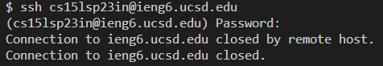

# Lab Report 1 - Remote Access
## Step 1: Installing VScode!
- Install [Visual Studio Code](https://code.visualstudio.com/) from the official websie.
- Follow the instructions on the website for the download and installation on your computer!

Open VScode and you will see a window similar to this:

## Step 2: Remotely Connecting!
- Now that VScode is open, open a terminal! You can use the shrotcut Ctrl + `
- Log in by entering the following command with your course-specific username: `ssh cs15lsp23in@ieng6.ucsd.edu`

Unfortunately, my login does not work :( This is the message that I get when trying to log in:

But that's okay! I can log in using my UCSD AD information.
I enter the command `ssh emn005@ieng6.ucsd.edu`

- When your username is correctly inputted, enter your password into the terminal. It may be invisible, so just click Enter after typing your password.
- When you have successfully logged in, something like this will appear in your terminal:

## Step 3: Trying Some Commands!
- Try running some commands in your terminal!
- I tried using the `ls` command, which lists the files in the working directory.
- `ls -a` does the same thing, but shows all of the hidden files as well.
- `ls -lat`produces a list of all files sorted by date.

