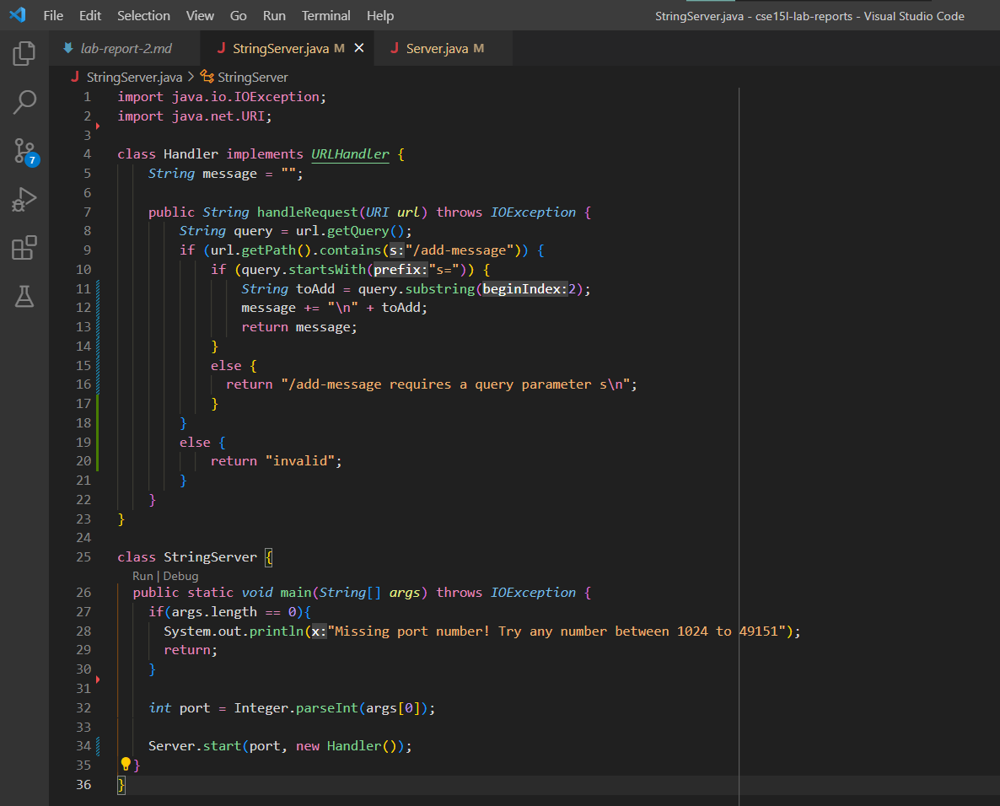
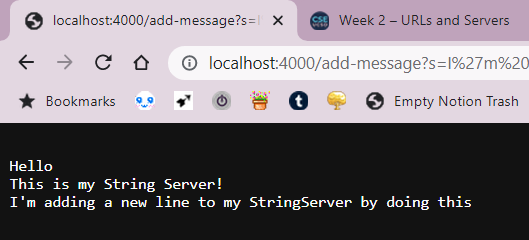
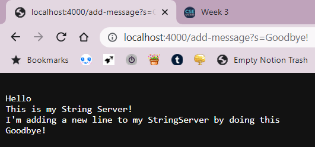
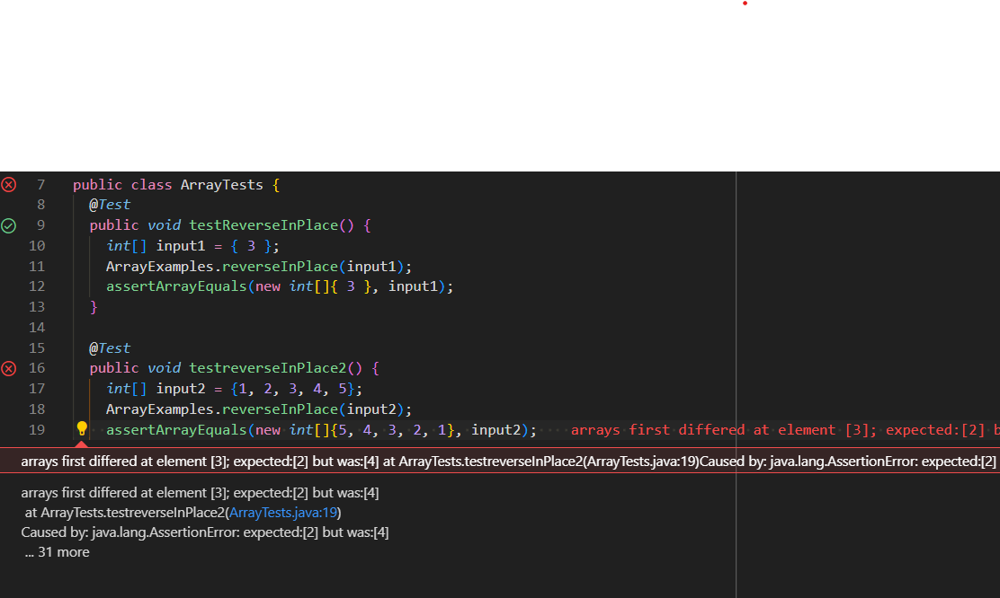

# Lab Report 2 - Servers and Bugs
## Part 1: Creating String Server!
- Hello! For this lab report, I started by writing code for StringServer.
- I referenced the code for NumberServer.java as well as the StringServer.java code from our first Skill Demo.
- I used those files as a base, and referenced JDK documentation to figure out how to read query arguments.
- It was very helpful!

- Here's my code!
> 

- After getting the server up and running, I added a few lines to the running string message by using `/add-message`

**Example 1:**
> 
> 
- This calls the HandleRequest method in my code
- The URL of "https://localhost:4000/add-message?s=I'm adding a new line to my String Server by doing this" is passed in as an argument.
- Then, it reads the substrings that follow the path after `/add-message` and after the query is started by `s=` and adds these substrings to `String` message

**Example 2:**
> 
- The same thing happens when I enter "Goodbye" too!
- The URL is taken in by the HandleRequest method, then whatever follows `s=` is put into `String` message and returned on the Server. Very cool.

## Part 2: Bugs!
- I'm going to explain some bugs that we found in ArrayExamples.java

- This is a test that I created to test the reverseInPlace method, which induced a failure.
```
@Test
  public void testreverseInPlace2() {
    int[] input2 = {1, 2, 3, 4, 5};
    ArrayExamples.reverseInPlace(input2);
    assertArrayEquals(new int[]{5, 4, 3, 2, 1}, input2);
  }
```

- This was a given test that did not create any failures in the program.
```
@Test 
	public void testReverseInPlace() {
    int[] input1 = { 3 };
    ArrayExamples.reverseInPlace(input1);
    assertArrayEquals(new int[]{ 3 }, input1);
	}
```

- When running both of these JUnit tests, these were the symptoms that occurred:
> 

- This was the code containing a bug, before I created any changes to it.
- **Before:**
```
static void reverseInPlace(int[] arr) {
    for(int i = 0; i < arr.length; i += 1) {
      arr[i] = arr[arr.length - i - 1];
    }
  }
```

- Then, I tweaked some parts of the code to make sure it works!
- This consisted of adjusting the for loop, as well as creating a temp variable
- **After:**
```
static void reverseInPlace(int[] arr) {
    for(int i = 0; i < arr.length/2; i += 1) {
      int temp = arr[i];
      arr[i] = arr[arr.length - i - 1];
      arr[arr.length - i - 1] = temp;
    }
  }
```
**Why did I fix the for loop?**
- It should only iterate throught the list up to where i < arr.length/2
- Iterating through the entire length of arr will result in the reversed list being identical to the original list.

**Why create a temp variable?**
- Store the original element's value before swapping the elements in the list


## Part 3: What I Learned!
- Something that I learned in week 2 & 3 was reading URL paths and inputting query arguments
- I thought messing around with the servers was pretty cool, even if it was a simple concept
- Professor Politz came into lab one of those days and explained to me how NumberServer.java worked
- I felt kind of bad asking him such a simple question... but he was so helpful!! Thank you Joe :D
