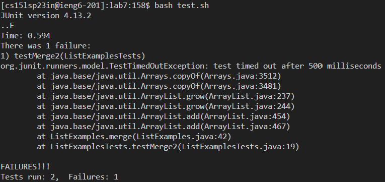

# Lab Report 4 - Vim

## Command Line Tasks!
These are the tasks I completed beforehand:
- Delete any existing forks of the repository you have on your account
- Fork the repository

Now, these will be the steps I complete!
- Step 4: Log into ieng6
> 
- I typed in `ssh cs15lsp23in@ieng6.ucsd.edu` and didn't have to log in with my password because I'm the best (ꈍᴗꈍ)

- Step 5: Clone your fork of the repository from your Github account
> 
- I typed in `git clone https://github.com/eleanormng/lab7` to clone the fork of the repository on my GitHub account

- Step 6: Run the tests, demonstrating that they fail
> 
- I typed in `cd lab7` to change to the right directory
- I typed in `bash test.sh` to quickly run the tests, which indeed showed failures

- Step 7: Edit the code file to fix the failing test
> 
- I typed `vim ListExamples.java` to open that file and make edits in vim
- Commands entered:
- `/?index` + `<enter>` To reverse-order search for "index"
- `e` to go to the end of the word
- `r` + `2` to replace 1 with 2
- `:wq` + `<enter>` to save and quit

- Step 8: Run the tests, demonstrating that they now succeed
> 
- `<up><up><enter>` to run bash test.sh, because this command was 2 up in the history

- Step 9: Commit and push the resulting change to your Github account (you can pick any commit message!)
> 
> 
- I typed `git add .` to save the changes that I made
- Typing `git commit` opened vim for me to write a commit message
- I typed `Edited ListExamples.java` as my commit message
- Finally, I used `git push` to push my changes. An error occurred that said my account could not be authenticated. I think this may be because when I cloned my repository, I didn't have `.git` at the end of my https url ｡:ﾟ(｡ﹷ ‸ ﹷ ✿)
