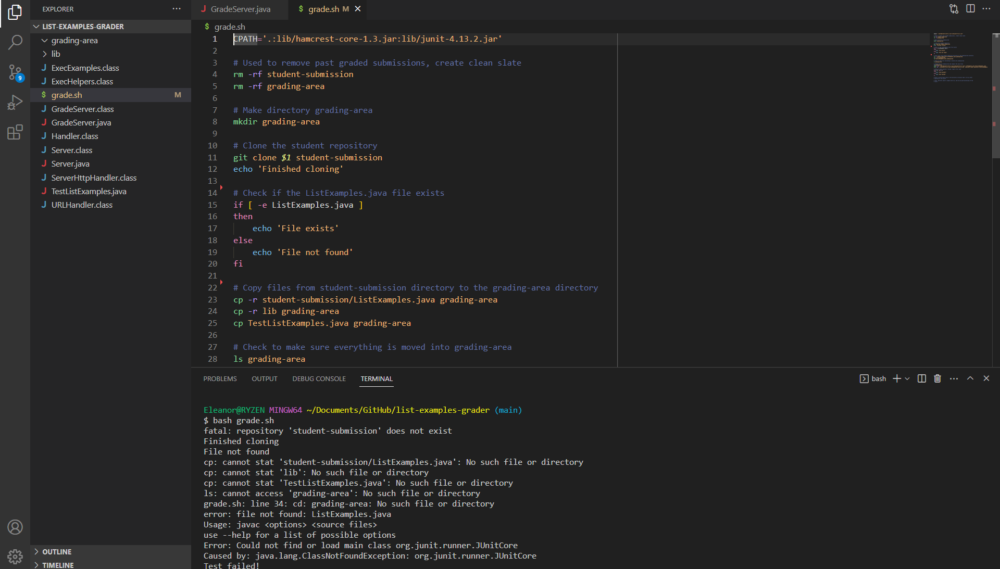

# Lab Report 5 - Putting It All Together!

## Part 1 - Debugging Scenario

- Student's Original Post

> 

*What environment are you using (computer, operating system, web browser, terminal/editor, and so on)?*
VSCode

*Detail the symptom you're seeing. Be specific; include both what you're seeing and what you expected to see instead. Screenshots are great, copy-pasted terminal output is also great. Avoid saying “it doesn't work”.*

I want to run the tests using grade.sh, but it's saying that I don't have the student submission even though I cloned it. What's wrong?
> 

*Detail the failure-inducing input and context. That might mean any or all of the command you're running, a test case, command-line arguments, working directory, even the last few commands you ran. Do your best to provide as much context as you can.*

I wrote the bash script to clone the student's submission and run the tests as needed.


- TA's Response

> 

Think about what directory you are working in. Try using the `ls` command to see what files you're working in to make sure you're in the right working directory! In addition, make sure you're passing the right argument into command line. What are you running grade.sh on?


- Identifying the Bug

> 

I tried using the ls command as you advised, and I've realized what the bug is.

> 

I am not in the correct directory. I have to change to the student-submission directory after cloning it, then change again to the parent directory before copying files over.

I also forgot to add in the link to the student's submission.


- Setup Information

File and directory structure:
> 

Contents of grade.sh before bug is fixed:
```
CPATH='.:lib/hamcrest-core-1.3.jar:lib/junit-4.13.2.jar'

# Used to remove past graded submissions, create clean slate
rm -rf student-submission
rm -rf grading-area

# Make directory grading-area
mkdir grading-area

# Clone the student repository
git clone $1 student-submission
echo 'Finished cloning'

# Change from List-Examples-Grader directory to student-submission directory
cd student-submission

# Check if the ListExamples.java file exists
if [ -e ListExamples.java ]
then
    echo 'File exists'
else
    echo 'File not found'
fi

# Change back to parent directory
cd ../

# Copy files from student-submission directory to the grading-area directory
cp -r student-submission/ListExamples.java grading-area
cp -r lib grading-area
cp TestListExamples.java grading-area

# Check to make sure everything is moved into grading-area
ls grading-area

# Change back to grading-area and compile the java files
cd grading-area
javac -cp ".;lib/hamcrest-core-1.3.jar;lib/junit-4.13.2.jar" ListExamples.java TestListExamples.java
java -cp ".;lib/junit-4.13.2.jar;lib/hamcrest-core-1.3.jar" org.junit.runner.JUnitCore TestListExamples

# Check if tests passed or failed, report error code
if [[ $? -eq 0 ]]
then
    echo "Tests passed!"
else
    echo "Test failed!"
fi
```

Command line to trigger bug:
`$ bash grade.sh`

How to fix the bug:
1. You need the line `cd student-submission` after cloning it.
2. You need to switch back to the parent directory to make sure you copy the student submission files into the grading area. Writing the line `../` should suffice.
3. When running the grading script from the command line, `$ bash grade.sh` needs to be followed by a link to the student's submission.
