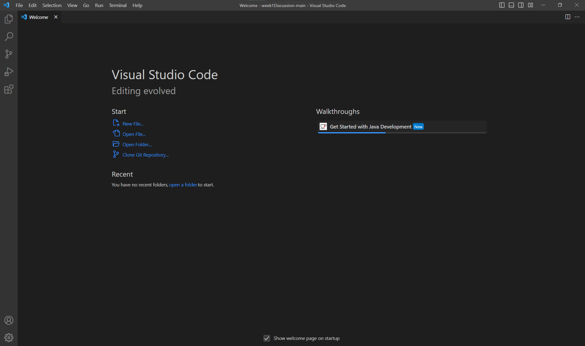
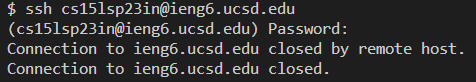

# Lab Report 1 - Remote Access
## Step 1: Installing VScode!
- Install [Visual Studio Code](https://code.visualstudio.com/) from the official websie.
- Follow the instructions on the website for the download and installation on your computer!

Open VScode and you will see a window similar to this:

## Step 2: Remotely Connecting!
- 
- Log in by entering the following command with your course-specific username: 

